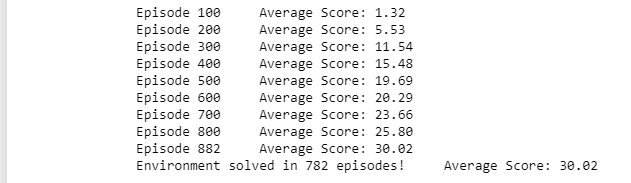
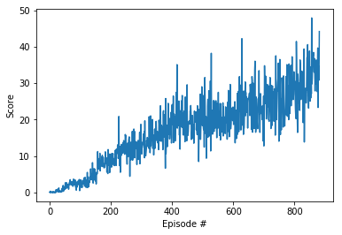

# Implementation description

 

## Learning Algorithm

*the code is mostly borrowed the shangtong zhang's repo which has highly modular and functional implementations and modified to work with this specific unity-ML environment(https://github.com/ShangtongZhang/DeepRL)

DDPG agent algorithm with simple replay buffer is used in this project. 

config - stores all the parameters,shapes,hyperparameters required for the algorithm and network
memory - replay Buffer
agent - ddpg agent
network - actor-critics
noise - ONoise

Configurations:
* 2 hidden layers with 256 and 128 hidden units for both actor and critic
* Replay batch size 512
* Buffer size 1e6
* Replay without prioritization
* Update frequency 4
* TAU from  1e-3
* Learning rate 1e-4 for actor and 3e-4 for critic
* Ornstein-Uhlenbeck noise

 

## Plot of Rewards
Plot of rewards can be seen after the environment has been solved.

Given the chosen architecture and parameters, our results are :

Environment solved in 782 episodes

 

## Ideas for Future Work
Here's a list of optimizations that can be applied to the project:
1. Build an agent that finds the best hyperparameters for an agent
2. Test shared network between agents
3. Test separate replay buffer for agents