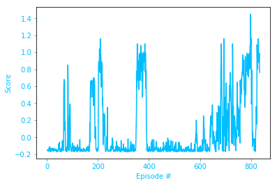
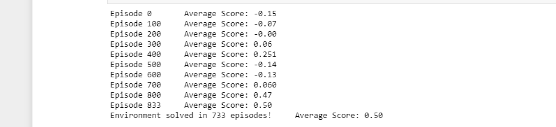

# Project 3 : Collaboration and Competition

## Agent Implementation

This project uses an *off-policy method* called **Multi Agent Deep Deterministic Policy Gradient (MADDPG)** algorithm.

### Background for Deep Deterministic Policy Gradient (DDPG)

MADDPG find its origins in an *off-policy method* called **Deep Deterministic Policy Gradient (DDPG)** and described in the paper [Continuous control with deep reinforcement learning](https://arxiv.org/abs/1509.02971). 

### Multi Agent Deep Deterministic Policy Gradient (MADDPG)

For this project I have used a variant of DDPG called **Multi Agent Deep Deterministic Policy Gradient (MADDPG)** which is  described in the paper [Multi-Agent Actor-Critic for Mixed Cooperative-Competitive Environments](https://arxiv.org/abs/1706.02275)

> We explore deep reinforcement learning methods for multi-agent domains. We begin by analyzing the difficulty of traditional algorithms in the multi-agent case: Q-learning is challenged by an inherent non-stationarity of the environment, while policy gradient suffers from a variance that increases as the number of agents grows. We then present an adaptation of actor-critic methods that considers action policies of other agents and is able to successfully learn policies that require complex multi-agent coordination. Additionally, we introduce a training regimen utilizing an ensemble of policies for each agent that leads to more robust multi-agent policies. We show the strength of our approach compared to existing methods in cooperative as well as competitive scenarios, where agent populations are able to discover various physical and informational coordination strategies.

> we accomplish our goal by adopting the framework of centralized training with
decentralized execution. Thus, we allow the policies to use extra information to ease training, so
long as this information is not used at test time. It is unnatural to do this with Q-learning, as the Q
function generally cannot contain different information at training and test time. Thus, we propose
a simple extension of actor-critic policy gradient methods where the critic is augmented with extra
information about the policies of other agents.

In short, this means that during the training, the Critics networks have access to the states and actions information of both agents, while the Actors networks have only access to the information corresponding to their local agent.

### Code implementation

The code used here is derived from the "maddpg lab-physical deception" tutorial from the [Deep Reinforcement Learning Nanodegree](https://www.udacity.com/course/deep-reinforcement-learning-nanodegree--nd893), and modified to implement the **Multi-Agent Actor Critic**  as discussed in the Multi-Agent Udacity tutorial lesson to work for unity ML-environment.

The code is written in [Python 3.6](https://www.python.org/downloads/release/python-360/) and is relying on [PyTorch 0.4.0](https://pytorch.org/docs/0.4.0/) framework.

The code consist of :

- `model.py` : Implement the **Actor** and the **Critic** classes.
    - The Actor and Critic classes each implement a *Target* and a *Local* Neural Networks used for the training.

- `maddpgpy`: Implement the MADDPG alorithm. 
  - The `maddpg` is relying on the `ddpg` class
   - It instanciates DDPG Agents
   - It provides a helper function to save the models checkpoints
   - It provides the `step()` and `act()` methods
   - As the **Multi-Agent Actor Critic** `learn()` function slightly differs from the DDPG one, a `maddpg_learn()` method is provided here.
    - The `learn()` method updates the policy and value parameters using given batch of experience tuples.
        ```
        Q_targets = r + γ * critic_target(next_state, actor_target(next_state))
        where:
            actor_target(states) -> action
            critic_target(all_states, all_actions) -> Q-value
        ```  
    
- `ddpg.py` : Implement the **DDPG agent** and a **Replay Buffer memory** used by the DDPG agent.
    - The Actor's *Local* and *Target* neural networks, and the Critic's *Local* and *Target* neural networks are instanciated by the Agent's constructor
    - The `learn()` method is specific to DDPG and is not used in this project (I keep it for code later code reuse)
  
- `memory.py` : Implement the Buffer Replay Memory
    - As it is accessed by both Agents, it is instanciated in the maddpg class instead of the ddpg class.
    
- `utils.py` : Implement some helper functions.

- `TennisProject.ipynb` : This Jupyter notebooks allows to instanciate and train both agent. More in details it allows to :
  - Prepare the Unity environment and Import the necessary packages 
  - Check the Unity environment
  - Define a helper function to instanciate and train a MADDPG agent
  - Train an agent using MADDPG 
  - Plot the score results

### MADDPG parameters and results


#### MADDPG parameters

The final version of my MADDPG agents uses the following parameters values (These parameters are passed in the `hyperparameters.py`  file.

```

NB_EPISODES = 1000                # Max nb of episodes
NB_STEPS = 500                    # Max nb of steps per episodes 
UPDATE_EVERY_NB_EPISODE = 4        # Nb of episodes between learning process
MULTIPLE_LEARN_PER_UPDATE = 2      # Nb of multiple learning process performed in a row

BUFFER_SIZE = int(500*1e4)             # replay buffer size
BATCH_SIZE = 1000                   # minibatch size

ACTOR_FC1_UNITS = 512              # Number of units for the layer 1 in the actor model
ACTOR_FC2_UNITS = 256              # Number of units for the layer 2 in the actor model
CRITIC_FCS1_UNITS = 512            # Number of units for the layer 1 in the critic model
CRITIC_FC2_UNITS = 256             # Number of units for the layer 2 in the critic model
NON_LIN = F.leaky_relu                   # Non linearity operator used in the model
LR_ACTOR = 1e-2                    # Learning rate of the actor 
LR_CRITIC = 3e-2   #2e-3           # Learning rate of the critic
WEIGHT_DECAY = 0                   # L2 weight decay

GAMMA = 1              # Discount factor
TAU = 1e-3                         # For soft update of target parameters
CLIP_CRITIC_GRADIENT = False       # Clip gradient during Critic optimization

ADD_OU_NOISE = True                # Add Ornstein-Uhlenbeck noise

NOISE = 2.0                        # Initial Noise Amplitude 
NOISE_REDUCTION = 0.99              # Noise amplitude decay ratio
```
            

Both Neural Networks use the Adam optimizer with a learning rate of 1e-2 (actors) and 3e-2 (critics) are trained using a batch size of 1000.

#### Results

Given the chosen architecture and parameters, our results are :



**These results meets the project's expectation as the agent is able to receive an average reward (over 100 episodes) of at least +0.5 in 733 episodes** 


### Ideas for future work
 
 - The model is trained using a single environment currently and training it using parallel environments would let the agrnt converge faster to better policy

- could use techniques like prioritized replay,dueling networks.

- open to suggestions-please provide 
